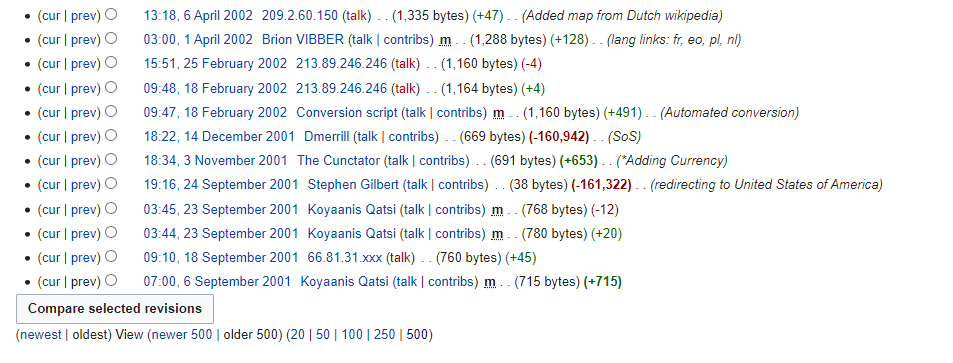
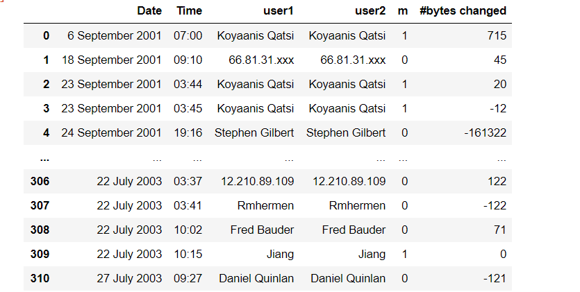

# Wiki Revision history scrap

Wiki Revision history scrap using Beautiful soup and pandas libraries and exporting it to a csv file.

This code can be used to crawl wikipedia revisions history data. 
I needed "Date" "Time" "user" "minor edits or not" "# of bytes changed" for a project. 

For example in the link below: 
https://en.wikipedia.org/w/index.php?title=United_States&offset=20030729010851%7C1215590&limit=500&action=history 

We can see the revisions:

Using the code, I have extracted the following:

I needed my data in reversed order. So I used reversed function in my loop. You can modify it according to your needs.

The above  can collect only 500 entries at once.
However, most of the articles have thousands of revision history entries.
To scrap those, I used pywikibot. It is a library that uses wiki media API .
It allows us to scrap all entries at once. 
The drawback with this is that, pwikibot does not have a size parameter to extract size.
The code is in scrap2.py
